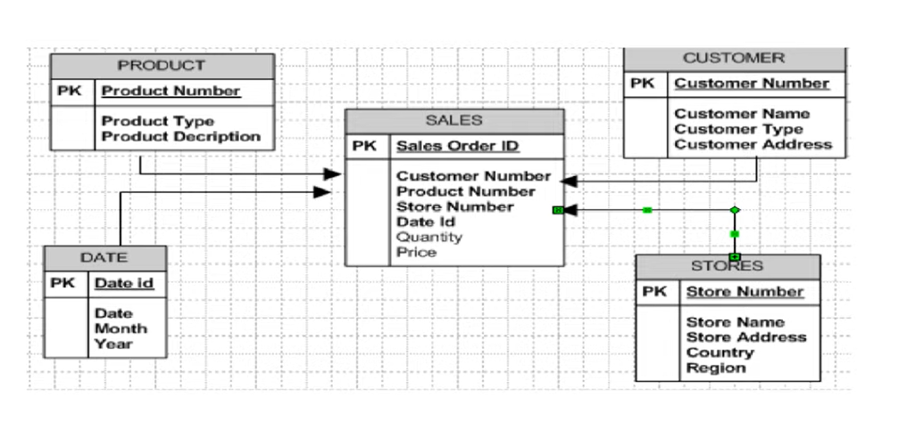
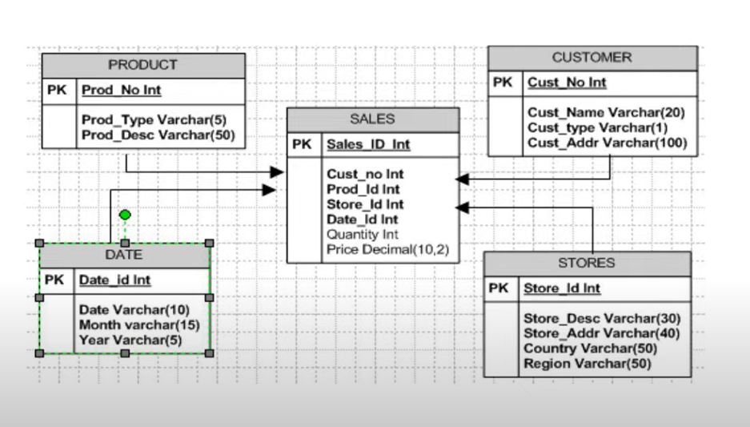
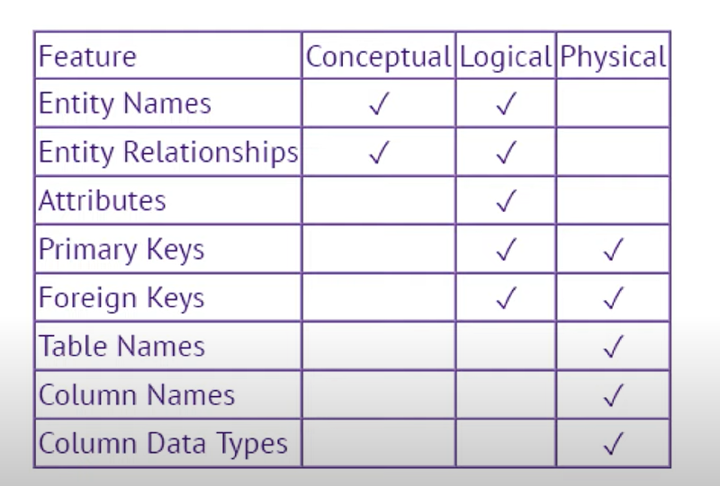

# ETL Testing

Most Popular ETL Testing Tools
- RightData.
- Xplenty.
- iCEDQ. https://www.softwaretestinghelp.com/top-4-etl-testing-tools/#3_iCEDQ
- DataQ. 
- BiG EVAL. 
- Informatica Data Validation. 
- QuerySurge. 
- Datagaps ETL Validator.

## What is Data Warehousing (DWH)

-  check [here](https://github.com/njain51/AZURE-DP900/tree/main/4_DataWareHousing_in_Azure)

### Database Testing VS ETL Testing

- **Database Testing**
  -  focus is on schemas, tables, columns, data types etc. 
  
- **ETL Testing**
  - 100% focus is on data not on relationship or table structure 
  

### What is Data Model?

**Note: entities <--> tables and attributes <--> columns** 

- Data model tells how the logical structure of database is modelled. 
- like what kind of tables we will have to store data. 
- what will be relationship between data 

- **types**:
  - **Conceptual Data Model**
    - it defines high level **entities and relationship** between them
    - we don't specify any attributes( columns etc. ) 
    - No keys are defined like primary key etc. 
    - These entities further form tables and we don't know much about tables in conceptual model 
    - 
  - **Logical Data Model** 
    - it defines **high level entities** and **relationship** between them but also **attributes** for each entity are specified
    - also we need to specify **keys** - primary keys, secondary keys etc. 
    - 
  - **Physical Data Model** 
    - here it displays all **entities** and **attributes** and keys
    - also it displays **data types**
    - 
    - So when we talk of physical data model it covers entire data design. 

- When we do ETL testing we need to refer Physical Data Model only. 

