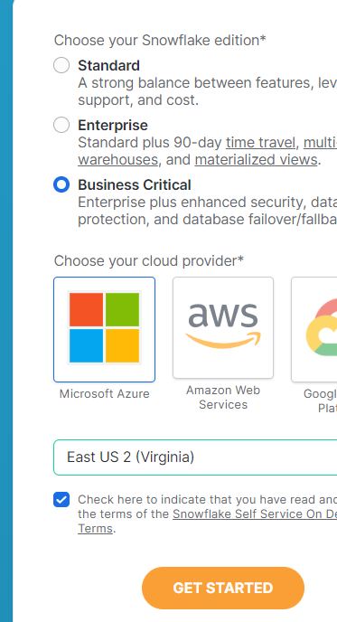

# SnowFlake

- its Analytical Cloud DWH Solution
- its Build on AWS
- It only works in Public Cloud
- it's a SAAS based solution


- Managing huge Data, Storage and analysis is basic job done by Snowflake
- In Snowflake, SQL queries are automatically generated compared to MYSQL where we need to write queries manually. 

### Creating Account - Free trial 

- https://signup.snowflake.com/
- 
- activate account via email 
- create username/pass - njain51/Od***3**
- https://app.snowflake.com/east-us-2.azure/rj81378/dashboards

```text
Note: 
- snowflake interface has changed
- to access old interface, can click on Classic Console
- https://rj81378.east-us-2.azure.snowflakecomputing.com/console#/internal/worksheet
- rj81378.east-us-2.azure.snowflakecomputing.com is your id
```

- its provided by Apple 
- 