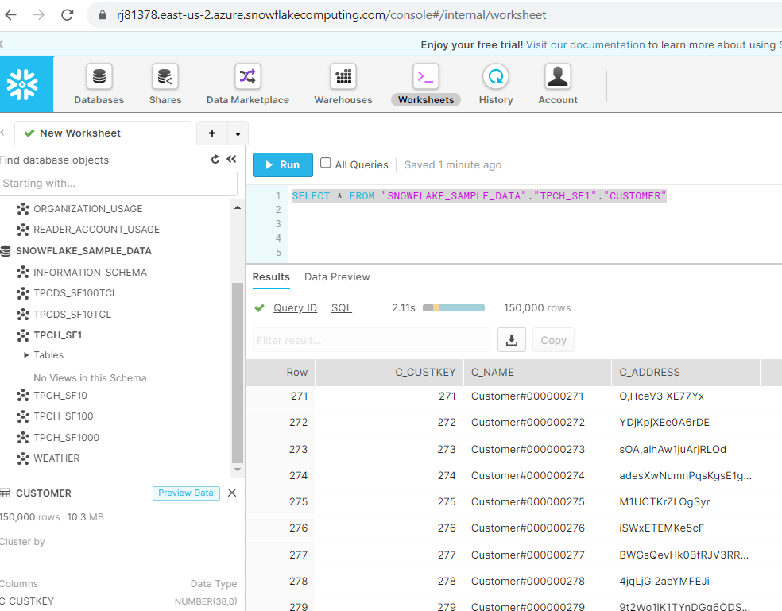
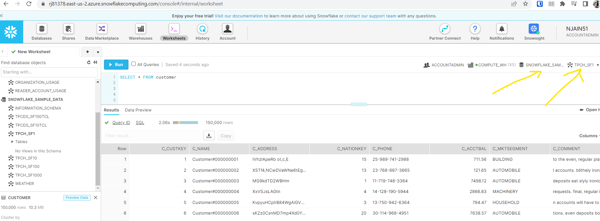

# How to Use Snowflake 

- login to web [url](https://rj81378.east-us-2.azure.snowflakecomputing.com/console#/internal/worksheet) in classic mode
- There are few Sample Databases already  provided by Snowflake and each Database contain multiple schema and each schema contains tables to play with. 
- To get data from Customer Table in TPCH_SF1 schema in SNOWFLAKE_SAMPLE_DATA database, we can run following query: 

```sql
SELECT * FROM "SNOWFLAKE_SAMPLE_DATA"."TPCH_SF1"."CUSTOMER"
```



- or we can get same results by preselecting database and schema in dropdown so that in query we just need to write customer:

