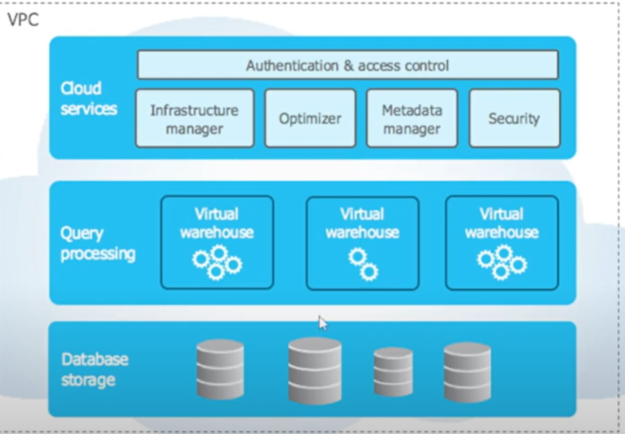

# SnowFlake Architecture

- Database Storage to store Databases which store queries, tables, data etc. 
- Next is Query Processing Engine where queries are processed
- At top we have various cloud services which include infra manager, optimizer, security etc. which has a top level later called auth and access control layer to manage access/authorization to snowflake

