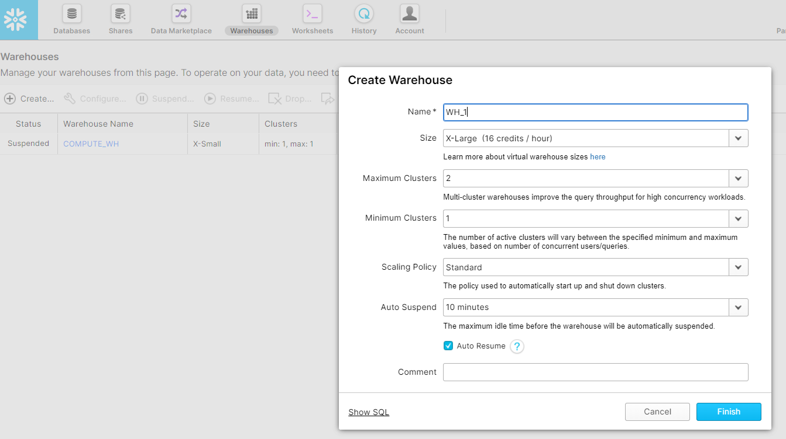

# Create Warehouse



or same can be created directly by running SQL as follows(get SQL from Show SQL link):

```sql
CREATE WAREHOUSE WH_1 WITH WAREHOUSE_SIZE = 'XLARGE' WAREHOUSE_TYPE = 'STANDARD' AUTO_SUSPEND = 600 AUTO_RESUME = TRUE MIN_CLUSTER_COUNT = 1 MAX_CLUSTER_COUNT = 2 SCALING_POLICY = 'STANDARD';
```

Note: 
- Auto Suspend Policy: The maximum idle time before the warehouse will be automatically suspended. Data is not deleted its just that its in idle state. 

- To Drop a warehouse:
```sql
DROP WAREHOUSE "FIRST_WH";
```