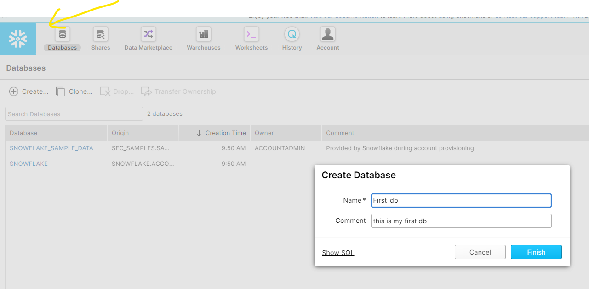

# Create Database and Tables in Snowflake

### Create Database:



Or

```sql
CREATE DATABASE First_db COMMENT = 'this is my first db';
```

### Create Tables in Db:


OR 

```sql
CREATE TABLE "FIRST_DB"."PUBLIC"."CUSTOMER" ("Cust Num" INTEGER NOT NULL, "Cust Name" STRING NOT NULL) COMMENT = 'All Customer data stored here';
```