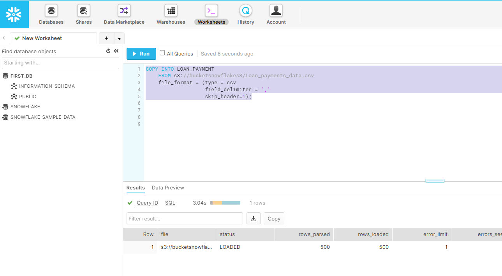
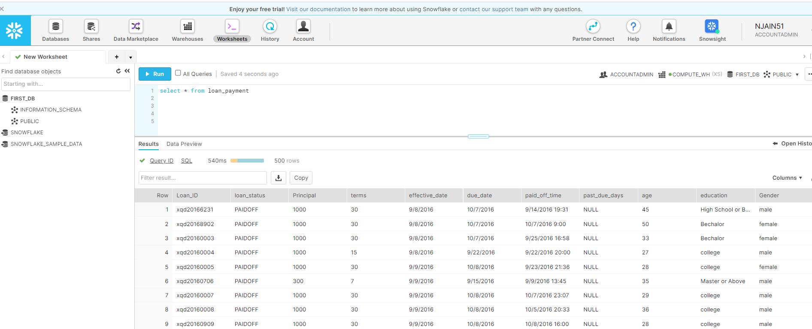

# Copy data from External Source to Snowflake

- Delete existing customer table from First_db database

```sql
Drop Table Customer
```

- create new table with following query:
```sql
CREATE TABLE "FIRST_DB"."PUBLIC"."LOAN_PAYMENT" (
  "Loan_ID" STRING,
  "loan_status" STRING,
  "Principal" STRING,
  "terms" STRING,
  "effective_date" STRING,
  "due_date" STRING,
  "paid_off_time" STRING,
  "past_due_days" STRING,
  "age" STRING,
  "education" STRING,
  "Gender" STRING);
```

- check if any data in existing table:
```sql
select * from Loan_payment
```
- there is no data currently

- copy data from external source:
```sql
COPY INTO LOAN_PAYMENT
    FROM s3://bucketsnowflakes3/Loan_payments_data.csv
    file_format = (type = csv 
                   field_delimiter = ',' 
                   skip_header=1);
```



- next we check again and data will be loaded from table loan_payment:
