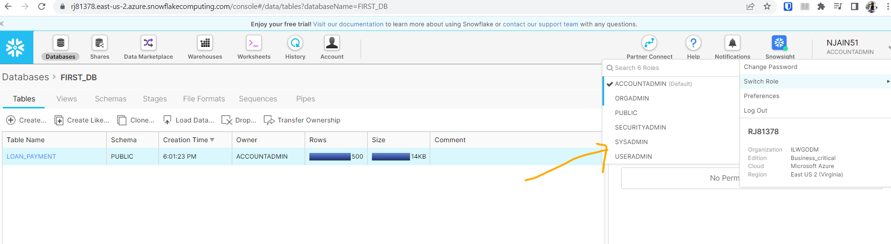

# Roles in Snowflake

- Following Roles are available in snowflake:

- **Roles**:
  - **ACCOUNTADMIN** - Account administrator can manage all aspects of the account.
    - can manage all info about user account
    - sysadmin and securityadmin privileges are included here
 
  - **ORGADMIN** - Organization administrator can manage organizations and accounts in organizations
    - organizations heads normally have this privilege to check org details 
    - can control accounts in org
  - **PUBLIC** - Public role is automatically available to every user in the account.
    - automatically granted to all users
  - **SECURITYADMIN** - Security administrator can manage security aspects of the account.
    - manage users and roles
    - 
  - **SYSADMIN** - System administrator can create and manage databases and warehouses.
    - create database and warehouse
  - **USERADMIN** - User administrator can create and manage users and roles
    - create users
 