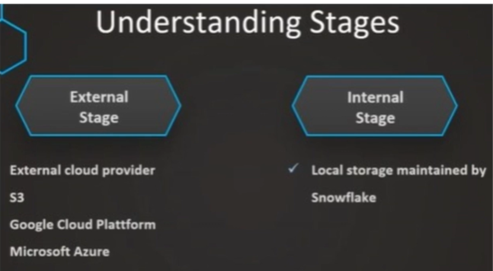
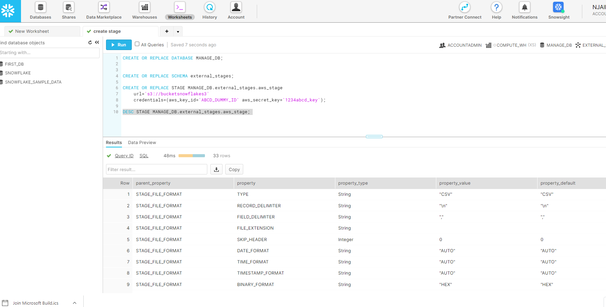
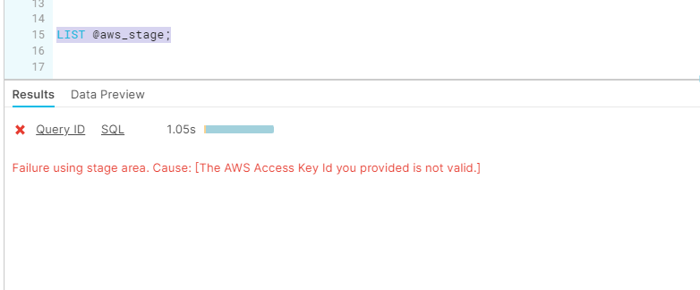
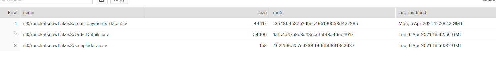

# Create Stage in Snowflake

- Stages in Snowflake are locations used to store data




- create database:
```sql
CREATE OR REPLACE DATABASE MANAGE_DB;
```

- create stages:
```sql
CREATE OR REPLACE SCHEMA external_stages;
```

- create stage area
```sql
CREATE OR REPLACE STAGE MANAGE_DB.external_stages.aws_stage
    url='s3://bucketsnowflakes3'
    credentials=(aws_key_id='ABCD_DUMMY_ID' aws_secret_key='1234abcd_key');
```

- Describe External stage created:
```sql
DESC STAGE MANAGE_DB.external_stages.aws_stage; 
```



- alter external stage:
```sql
ALTER STAGE aws_stage
    SET credentials=(aws_key_id='XYZ_DUMMY_ID' aws_secret_key='987xyz');
```

- list files in stage:
```sql
LIST @aws_stage;
```

- it gives error since there are no public staging area

- next we create Publicly accessible staging area    
```sql
CREATE OR REPLACE STAGE MANAGE_DB.external_stages.aws_stage
    url='s3://bucketsnowflakes3';
```
- next we try to list files in stage again:
```sql
LIST @aws_stage;
```

