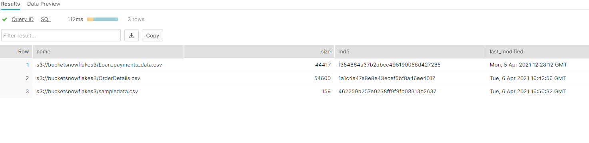
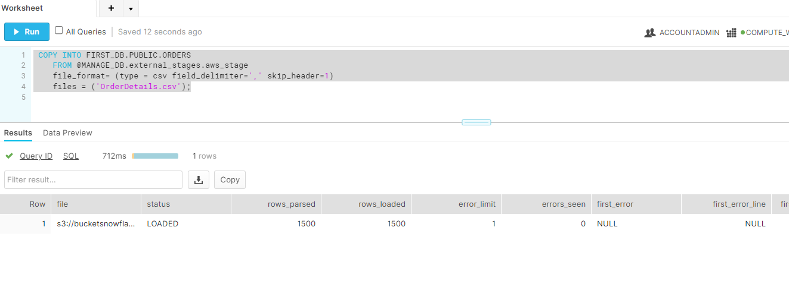

# Copy data from stages to table in snowflake

- Create Orders table
```sql
CREATE OR REPLACE TABLE FIRST_DB.PUBLIC.ORDERS (
    ORDER_ID VARCHAR(30),
    AMOUNT INT,
    PROFIT INT,
    QUANTITY INT,
    CATEGORY VARCHAR(30),
    SUBCATEGORY VARCHAR(30));
```

- check if any data present:
```sql
SELECT * FROM OUR_FIRST_DB.PUBLIC.ORDERS;
```

- Table is empty currently

- lets try to copy into this table from stage
```sql
COPY INTO  FIRST_DB.PUBLIC.ORDERS
    FROM @manage_db.external_stages.aws_stage
    file_format = (type = csv field_delimiter=',' skip_header=1);
```

error:
```text
Number of columns in file (2) does not match that of the corresponding table (6), use file format option error_on_column_count_mismatch=false to ignore this error File 'sampledata.csv', line 3, character 1 Row 1 starts at line 2, column "ORDERS"["AMOUNT":2] If you would like to continue loading when an error is encountered, use other values such as 'SKIP_FILE' or 'CONTINUE' for the ON_ERROR option. For more information on loading options, please run 'info loading_data' in a SQL client.
```

- lets first list files in stage:
```sql
List @manage_db.external_stages.aws_stage
```



- copy command with specified file:
```sql
 COPY INTO FIRST_DB.PUBLIC.ORDERS
    FROM @MANAGE_DB.external_stages.aws_stage
    file_format= (type = csv field_delimiter=',' skip_header=1)
    files = ('OrderDetails.csv');
```



- copy command with specified pattern( note table need to be created again)
```sql
CREATE OR REPLACE TABLE FIRST_DB.PUBLIC.ORDERS (
    ORDER_ID VARCHAR(30),
    AMOUNT INT,
    PROFIT INT,
    QUANTITY INT,
    CATEGORY VARCHAR(30),
    SUBCATEGORY VARCHAR(30));

COPY INTO FIRST_DB.PUBLIC.ORDERS
    FROM @MANAGE_DB.external_stages.aws_stage
    file_format= (type = csv field_delimiter=',' skip_header=1)
    pattern='.*Order.*';
```