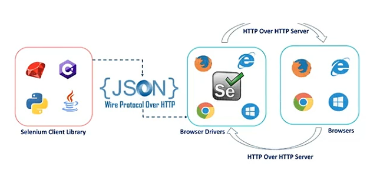

# Intro

 ## what is Selenium? 

- its opensource Automation Testing Tool
- it's exclusively for web based applications
- it supports multiple browser - Chrome, firefox, IE
- works with multiple platform - linux, mac, windows etc. 
- it can be coded in multiple languages - java, python, C#, javascript etc.
  - selenium with java is the hottest combination

## Difference between Selenium and Webdriver? 

- [Selenium website](https://www.selenium.dev/)
- Selenium is a suite of tools to automate web browsers across many platforms
- Selenium supports multiple tools like - Selenium webdriver, Selenium IDE, Selenium Grid etc. 
 
## Selenium webdriver architecture

- After we trigger the test, complete selenium code(**Client**) will be converted to JSON format
- Generated Json will be sent to browser driver(**Server**) via http protocol.Each browser contain separate browser driver. example: Chrome will have Chrome driver, firefox will have firefox driver etc.

- Browser driver communicate with its respective browser and execute the commands on the browser by interpreting Json which is received.
- Browser driver receive response back from the browser and it sends Json response back to client.

Note:
  - this Chrome browser driver are available for download and we need to provide path in the Selenium Script else Script will not know where to send json code to browser.

