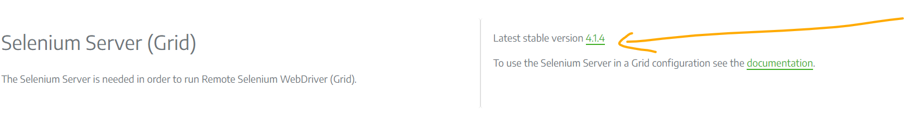
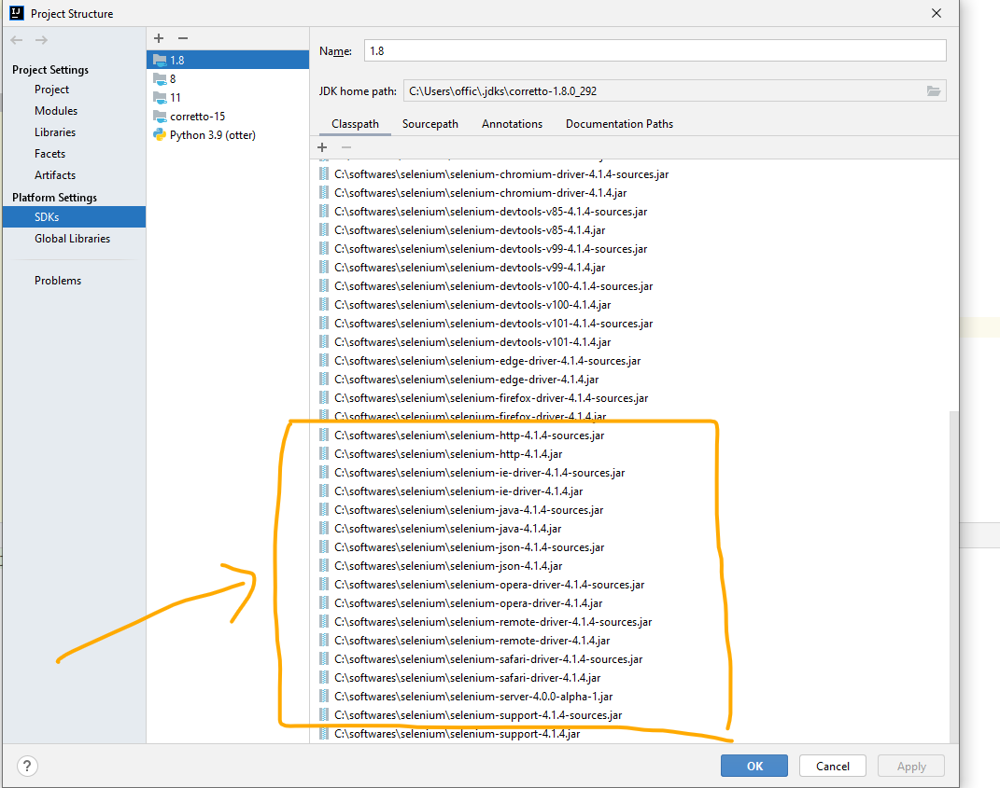

# Run First Program

- Configure Java path in System variable and java version check 

```text
C:\Users\offic>java -version
java version "1.8.0_333"
Java(TM) SE Runtime Environment (build 1.8.0_333-b02)
Java HotSpot(TM) 64-Bit Server VM (build 25.333-b02, mixed mode)

```
- IntelliJ download
  - Create new java project
- Selenium jars download and configure in project build path
    - install selenium server jar from here https://www.selenium.dev/downloads/ 
    - get selenium language specific jars (in our case - java jars) from here https://www.selenium.dev/downloads/ 
    - add jar to intelliJ project path  
    - include lib jars folder too in classpath
    - if we check selenium jars documentation [here](https://www.selenium.dev/selenium/docs/api/java/org/openqa/selenium/WebDriver.html) you will see  implementing class of  webdriver interface for Chrome is [ChromeDriver](https://www.selenium.dev/selenium/docs/api/java/org/openqa/selenium/chrome/ChromeDriver.html)
    - these browsers are third party and due to security reasons they dont allow selenium to directly invoke it via api so we need to download and provide browser exe in path. 
    - get ChromeDriver latest here https://chromedriver.storage.googleapis.com/index.html?path=102.0.5005.27/
    - get Microsoft Edge driver here https://developer.microsoft.com/en-us/microsoft-edge/tools/webdriver/
  
- choose browser to run - we have chosen chrome browser for testing
```text
important keys depending on browser types:
Chrome:  webdriver.chrome.driver
Firefox: webdriver.gecko.driver
IE: webdriver.ie.driver
```
- create driver object based on chosen driver
- set system property on browser
- run first program

- find working code [here](https://github.com/njain51/selenium-demo)