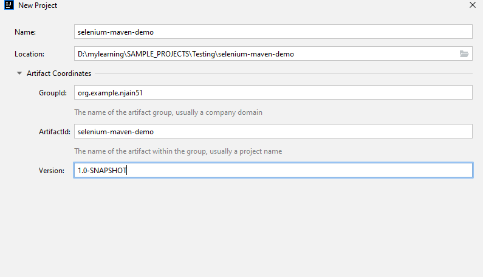
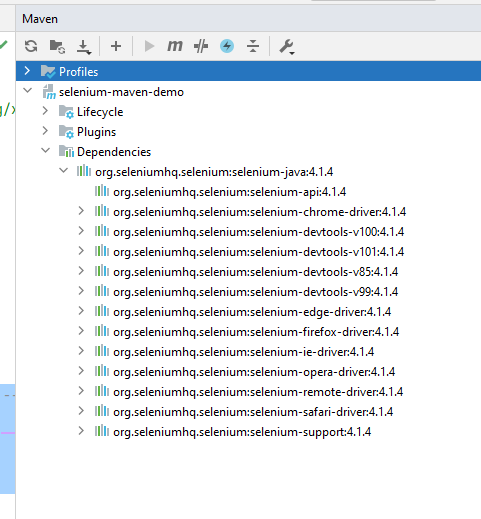

# Create Selenium Maven project

- File -> New -> Maven
- 
- get selenium maven dependency from here: https://mvnrepository.com/artifact/org.seleniumhq.selenium/selenium-java/4.1.4
```text
        <!-- https://mvnrepository.com/artifact/org.seleniumhq.selenium/selenium-java -->
        <dependency>
            <groupId>org.seleniumhq.selenium</groupId>
            <artifactId>selenium-java</artifactId>
            <version>4.1.4</version>
        </dependency>
```
- dependencies are automatically included:


- Selenium repo location from where artifacts are downloaded: https://repo1.maven.org/maven2/org/seleniumhq/selenium/
- add java pacakge and demo class
- it should build successfully
- added driver for firefox from here: https://github.com/mozilla/geckodriver/releases/download/v0.31.0/geckodriver-v0.31.0-win64.zip and save at local
- added new method to run test in firefox

Output:
```text
C:\Users\offic\.jdks\corretto-1.8.0_292\bin\java.exe "-javaagent:C:\Program Files\JetBrains\IntelliJ IDEA 2021.1\lib\idea_rt.jar=50748:C:\Program Files\JetBrains\IntelliJ IDEA 2021.1\bin" -Dfile.encoding=UTF-8 -classpath C:\Users\offic\.jdks\corretto-1.8.0_292\jre\lib\charsets.jar;C:\Users\offic\.jdks\corretto-1.8.0_292\jre\lib\ext\access-bridge-64.jar;C:\Users\offic\.jdks\corretto-1.8.0_292\jre\lib\ext\cldrdata.jar;C:\Users\offic\.jdks\corretto-1.8.0_292\jre\lib\ext\dnsns.jar;C:\Users\offic\.jdks\corretto-1.8.0_292\jre\lib\ext\jaccess.jar;C:\Users\offic\.jdks\corretto-1.8.0_292\jre\lib\ext\jfxrt.jar;C:\Users\offic\.jdks\corretto-1.8.0_292\jre\lib\ext\localedata.jar;C:\Users\offic\.jdks\corretto-1.8.0_292\jre\lib\ext\nashorn.jar;C:\Users\offic\.jdks\corretto-1.8.0_292\jre\lib\ext\sunec.jar;C:\Users\offic\.jdks\corretto-1.8.0_292\jre\lib\ext\sunjce_provider.jar;C:\Users\offic\.jdks\corretto-1.8.0_292\jre\lib\ext\sunmscapi.jar;C:\Users\offic\.jdks\corretto-1.8.0_292\jre\lib\ext\sunpkcs11.jar;C:\Users\offic\.jdks\corretto-1.8.0_292\jre\lib\ext\zipfs.jar;C:\Users\offic\.jdks\corretto-1.8.0_292\jre\lib\jce.jar;C:\Users\offic\.jdks\corretto-1.8.0_292\jre\lib\jfr.jar;C:\Users\offic\.jdks\corretto-1.8.0_292\jre\lib\jfxswt.jar;C:\Users\offic\.jdks\corretto-1.8.0_292\jre\lib\jsse.jar;C:\Users\offic\.jdks\corretto-1.8.0_292\jre\lib\management-agent.jar;C:\Users\offic\.jdks\corretto-1.8.0_292\jre\lib\resources.jar;C:\Users\offic\.jdks\corretto-1.8.0_292\jre\lib\rt.jar;D:\mylearning\SAMPLE_PROJECTS\Testing\selenium-maven-demo\target\test-classes;C:\Users\offic\.m2\repository\org\seleniumhq\selenium\selenium-java\4.1.4\selenium-java-4.1.4.jar;C:\Users\offic\.m2\repository\org\seleniumhq\selenium\selenium-api\4.1.4\selenium-api-4.1.4.jar;C:\Users\offic\.m2\repository\org\seleniumhq\selenium\selenium-chrome-driver\4.1.4\selenium-chrome-driver-4.1.4.jar;C:\Users\offic\.m2\repository\com\google\auto\service\auto-service-annotations\1.0.1\auto-service-annotations-1.0.1.jar;C:\Users\offic\.m2\repository\com\google\auto\service\auto-service\1.0.1\auto-service-1.0.1.jar;C:\Users\offic\.m2\repository\com\google\auto\auto-common\1.2\auto-common-1.2.jar;C:\Users\offic\.m2\repository\com\google\guava\guava\31.1-jre\guava-31.1-jre.jar;C:\Users\offic\.m2\repository\com\google\guava\failureaccess\1.0.1\failureaccess-1.0.1.jar;C:\Users\offic\.m2\repository\com\google\guava\listenablefuture\9999.0-empty-to-avoid-conflict-with-guava\listenablefuture-9999.0-empty-to-avoid-conflict-with-guava.jar;C:\Users\offic\.m2\repository\com\google\code\findbugs\jsr305\3.0.2\jsr305-3.0.2.jar;C:\Users\offic\.m2\repository\org\checkerframework\checker-qual\3.12.0\checker-qual-3.12.0.jar;C:\Users\offic\.m2\repository\com\google\errorprone\error_prone_annotations\2.11.0\error_prone_annotations-2.11.0.jar;C:\Users\offic\.m2\repository\com\google\j2objc\j2objc-annotations\1.3\j2objc-annotations-1.3.jar;C:\Users\offic\.m2\repository\org\seleniumhq\selenium\selenium-chromium-driver\4.1.4\selenium-chromium-driver-4.1.4.jar;C:\Users\offic\.m2\repository\org\seleniumhq\selenium\selenium-json\4.1.4\selenium-json-4.1.4.jar;C:\Users\offic\.m2\repository\org\seleniumhq\selenium\selenium-devtools-v100\4.1.4\selenium-devtools-v100-4.1.4.jar;C:\Users\offic\.m2\repository\org\seleniumhq\selenium\selenium-devtools-v101\4.1.4\selenium-devtools-v101-4.1.4.jar;C:\Users\offic\.m2\repository\org\seleniumhq\selenium\selenium-devtools-v85\4.1.4\selenium-devtools-v85-4.1.4.jar;C:\Users\offic\.m2\repository\org\seleniumhq\selenium\selenium-devtools-v99\4.1.4\selenium-devtools-v99-4.1.4.jar;C:\Users\offic\.m2\repository\org\seleniumhq\selenium\selenium-edge-driver\4.1.4\selenium-edge-driver-4.1.4.jar;C:\Users\offic\.m2\repository\org\seleniumhq\selenium\selenium-firefox-driver\4.1.4\selenium-firefox-driver-4.1.4.jar;C:\Users\offic\.m2\repository\org\seleniumhq\selenium\selenium-ie-driver\4.1.4\selenium-ie-driver-4.1.4.jar;C:\Users\offic\.m2\repository\org\seleniumhq\selenium\selenium-opera-driver\4.1.4\selenium-opera-driver-4.1.4.jar;C:\Users\offic\.m2\repository\org\seleniumhq\selenium\selenium-remote-driver\4.1.4\selenium-remote-driver-4.1.4.jar;C:\Users\offic\.m2\repository\com\beust\jcommander\1.82\jcommander-1.82.jar;C:\Users\offic\.m2\repository\io\netty\netty-buffer\4.1.76.Final\netty-buffer-4.1.76.Final.jar;C:\Users\offic\.m2\repository\io\netty\netty-codec-http\4.1.76.Final\netty-codec-http-4.1.76.Final.jar;C:\Users\offic\.m2\repository\io\netty\netty-codec\4.1.76.Final\netty-codec-4.1.76.Final.jar;C:\Users\offic\.m2\repository\io\netty\netty-handler\4.1.76.Final\netty-handler-4.1.76.Final.jar;C:\Users\offic\.m2\repository\io\netty\netty-common\4.1.76.Final\netty-common-4.1.76.Final.jar;C:\Users\offic\.m2\repository\io\netty\netty-transport-classes-epoll\4.1.76.Final\netty-transport-classes-epoll-4.1.76.Final.jar;C:\Users\offic\.m2\repository\io\netty\netty-transport-classes-kqueue\4.1.76.Final\netty-transport-classes-kqueue-4.1.76.Final.jar;C:\Users\offic\.m2\repository\io\netty\netty-transport-native-epoll\4.1.76.Final\netty-transport-native-epoll-4.1.76.Final.jar;C:\Users\offic\.m2\repository\io\netty\netty-transport-native-kqueue\4.1.76.Final\netty-transport-native-kqueue-4.1.76.Final.jar;C:\Users\offic\.m2\repository\io\netty\netty-transport-native-unix-common\4.1.76.Final\netty-transport-native-unix-common-4.1.76.Final.jar;C:\Users\offic\.m2\repository\io\netty\netty-transport\4.1.76.Final\netty-transport-4.1.76.Final.jar;C:\Users\offic\.m2\repository\io\netty\netty-resolver\4.1.76.Final\netty-resolver-4.1.76.Final.jar;C:\Users\offic\.m2\repository\io\opentelemetry\opentelemetry-api\1.13.0\opentelemetry-api-1.13.0.jar;C:\Users\offic\.m2\repository\io\opentelemetry\opentelemetry-context\1.13.0\opentelemetry-context-1.13.0.jar;C:\Users\offic\.m2\repository\io\opentelemetry\opentelemetry-exporter-logging\1.13.0\opentelemetry-exporter-logging-1.13.0.jar;C:\Users\offic\.m2\repository\io\opentelemetry\opentelemetry-sdk-metrics\1.13.0-alpha\opentelemetry-sdk-metrics-1.13.0-alpha.jar;C:\Users\offic\.m2\repository\io\opentelemetry\opentelemetry-sdk-logs\1.13.0-alpha\opentelemetry-sdk-logs-1.13.0-alpha.jar;C:\Users\offic\.m2\repository\io\opentelemetry\opentelemetry-sdk-common\1.13.0\opentelemetry-sdk-common-1.13.0.jar;C:\Users\offic\.m2\repository\io\opentelemetry\opentelemetry-sdk-extension-autoconfigure-spi\1.13.0\opentelemetry-sdk-extension-autoconfigure-spi-1.13.0.jar;C:\Users\offic\.m2\repository\io\opentelemetry\opentelemetry-sdk-extension-autoconfigure\1.13.0-alpha\opentelemetry-sdk-extension-autoconfigure-1.13.0-alpha.jar;C:\Users\offic\.m2\repository\io\opentelemetry\opentelemetry-sdk-trace\1.13.0\opentelemetry-sdk-trace-1.13.0.jar;C:\Users\offic\.m2\repository\io\opentelemetry\opentelemetry-sdk\1.13.0\opentelemetry-sdk-1.13.0.jar;C:\Users\offic\.m2\repository\io\opentelemetry\opentelemetry-semconv\1.13.0-alpha\opentelemetry-semconv-1.13.0-alpha.jar;C:\Users\offic\.m2\repository\io\ous\jtoml\2.0.0\jtoml-2.0.0.jar;C:\Users\offic\.m2\repository\net\bytebuddy\byte-buddy\1.12.9\byte-buddy-1.12.9.jar;C:\Users\offic\.m2\repository\org\apache\commons\commons-exec\1.3\commons-exec-1.3.jar;C:\Users\offic\.m2\repository\org\asynchttpclient\async-http-client\2.12.3\async-http-client-2.12.3.jar;C:\Users\offic\.m2\repository\org\asynchttpclient\async-http-client-netty-utils\2.12.3\async-http-client-netty-utils-2.12.3.jar;C:\Users\offic\.m2\repository\io\netty\netty-codec-socks\4.1.60.Final\netty-codec-socks-4.1.60.Final.jar;C:\Users\offic\.m2\repository\io\netty\netty-handler-proxy\4.1.60.Final\netty-handler-proxy-4.1.60.Final.jar;C:\Users\offic\.m2\repository\io\netty\netty-transport-native-epoll\4.1.60.Final\netty-transport-native-epoll-4.1.60.Final-linux-x86_64.jar;C:\Users\offic\.m2\repository\io\netty\netty-transport-native-kqueue\4.1.60.Final\netty-transport-native-kqueue-4.1.60.Final-osx-x86_64.jar;C:\Users\offic\.m2\repository\org\reactivestreams\reactive-streams\1.0.3\reactive-streams-1.0.3.jar;C:\Users\offic\.m2\repository\com\typesafe\netty\netty-reactive-streams\2.0.4\netty-reactive-streams-2.0.4.jar;C:\Users\offic\.m2\repository\org\slf4j\slf4j-api\1.7.30\slf4j-api-1.7.30.jar;C:\Users\offic\.m2\repository\com\sun\activation\jakarta.activation\1.2.2\jakarta.activation-1.2.2.jar;C:\Users\offic\.m2\repository\org\seleniumhq\selenium\selenium-http\4.1.4\selenium-http-4.1.4.jar;C:\Users\offic\.m2\repository\dev\failsafe\failsafe\3.2.3\failsafe-3.2.3.jar;C:\Users\offic\.m2\repository\org\seleniumhq\selenium\selenium-safari-driver\4.1.4\selenium-safari-driver-4.1.4.jar;C:\Users\offic\.m2\repository\org\seleniumhq\selenium\selenium-support\4.1.4\selenium-support-4.1.4.jar com.example.njain51.Selenium_demo
SLF4J: Failed to load class "org.slf4j.impl.StaticLoggerBinder".
SLF4J: Defaulting to no-operation (NOP) logger implementation
SLF4J: See http://www.slf4j.org/codes.html#StaticLoggerBinder for further details.
Starting ChromeDriver 101.0.4951.15 (0dcf182bd3881ac6567fb51e86a17ba341d19475-refs/branch-heads/4951@{#217}) on port 61128
Only local connections are allowed.
Please see https://chromedriver.chromium.org/security-considerations for suggestions on keeping ChromeDriver safe.
ChromeDriver was started successfully.
May 16, 2022 8:00:15 PM org.openqa.selenium.remote.ProtocolHandshake createSession
INFO: Detected dialect: W3C
May 16, 2022 8:00:15 PM org.openqa.selenium.devtools.CdpVersionFinder findNearestMatch
INFO: Found exact CDP implementation for version 101
Google
1652745617858	geckodriver	INFO	Listening on 127.0.0.1:53216
1652745618327	mozrunner::runner	INFO	Running command: "C:\\Program Files\\Mozilla Firefox\\firefox.exe" "--marionette" "--remote-debugging-port" "64882" "--remote-allow-hosts" "localhost" "-no-remote" "-profile" "C:\\Users\\offic\\AppData\\Local\\Temp\\rust_mozprofile6TjVph"
1652745618664	Marionette	INFO	Marionette enabled
console.warn: SearchSettings: "get: No settings file exists, new profile?" (new NotFoundError("Could not open the file at C:\\Users\\offic\\AppData\\Local\\Temp\\rust_mozprofile6TjVph\\search.json.mozlz4", (void 0)))
DevTools listening on ws://localhost:64882/devtools/browser/a228207f-3e07-4e82-a6f5-58def1e0f57e
1652745620096	Marionette	INFO	Listening on port 50832
Read port: 50832
1652745620150	RemoteAgent	WARN	TLS certificate errors will be ignored for this session
May 16, 2022 8:00:20 PM org.openqa.selenium.remote.ProtocolHandshake createSession
INFO: Detected dialect: W3C
Google
1652745621500	Marionette	INFO	Stopped listening on port 50832
JavaScript error: resource://gre/modules/TerminatorTelemetry.jsm, line 71: AbortError: IOUtils: Shutting down and refusing additional I/O tasks

Process finished with exit code 0
```
- get code [here](https://github.com/njain51/selenium-maven-demo)

- tag created  [here](https://github.com/njain51/selenium-maven-demo/tree/1.0.0)