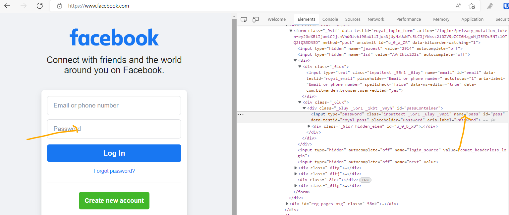
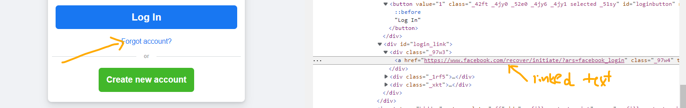

# Locator identifiers in Selenium

## What is locator in selenium
- its one of most important section in Selenium
- Locator is a command that tells Selenium IDE which GUI elements ( say Text Box, Buttons, Check Boxes etc) its needs to operate on. 
- Identification of correct GUI elements is a prerequisite to creating an automation script.
- There are commands that do not need a locator (such as the “open” command). However, most of them do need element Locators in Selenium webdriver.
- The choice of locator depends largely on your Application Under Test.

## Different locators

### id

```text
Target Format: id=id of the element
```


**Note**:
- if id is **alphanumeric** then on evey browser refresh,id may vary every time. 
- every object may not have className or name, xpath or css. When inspecting the element we need to identify which element is fixed and can be used to get the handle. 
- Selenium scans element from top left and in case of any conflict it will take the first match 

### name



### linked text



example2 - via partiallinkedtext:
```text
        driver.get("https://www.google.com");
        driver.findElement(By.name("q")).sendKeys("AWS Migration", Keys.ENTER);
        driver.findElement(By.partialLinkText("https://aws.amazon.com/")).click();
        Thread.sleep(4000);
```

Note:
- all links have tag `<a>` so when we see this anchor we can confirm its linked text
- 
### classname

Note:
- when we have className with spaces, selenium will not accept it and will throw error "compound classes not accepted"

### xpath
### css


