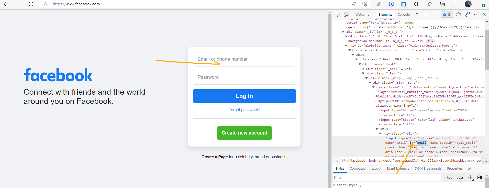
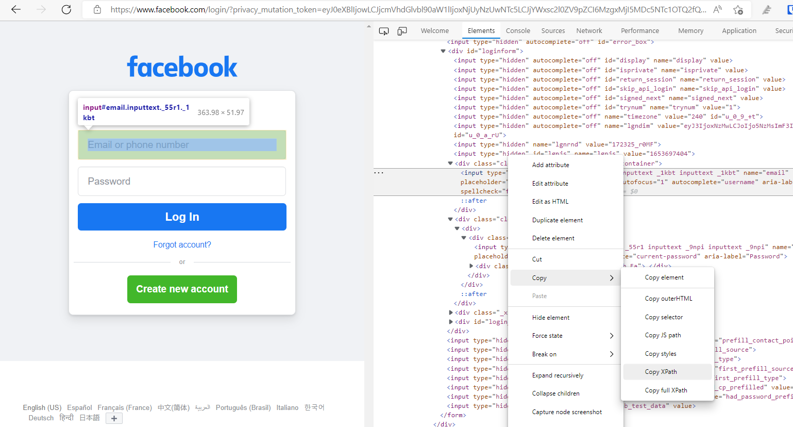
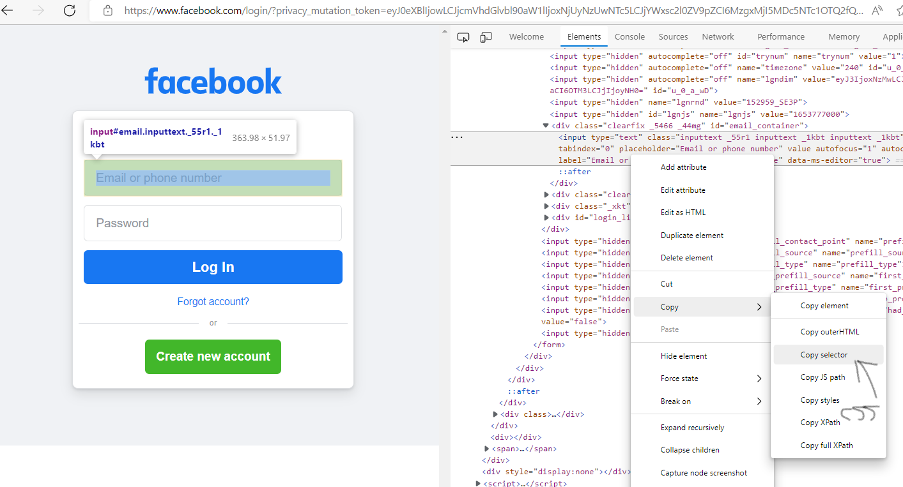
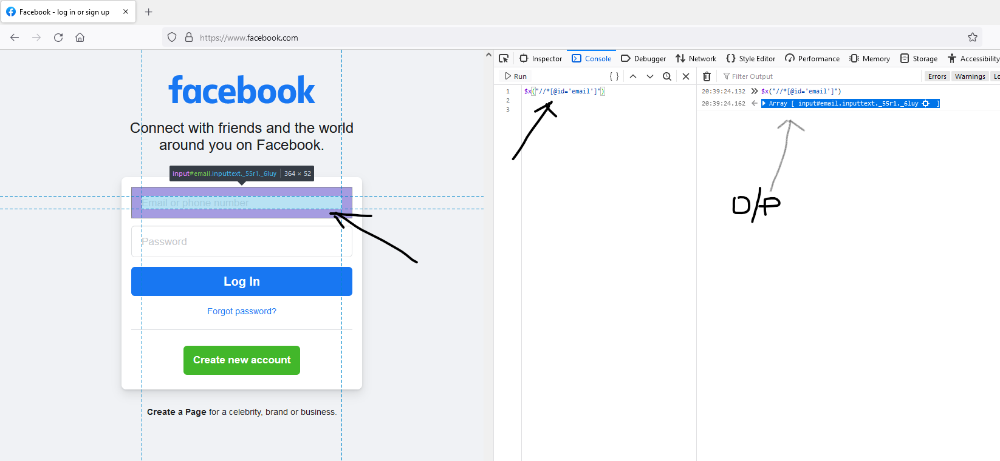
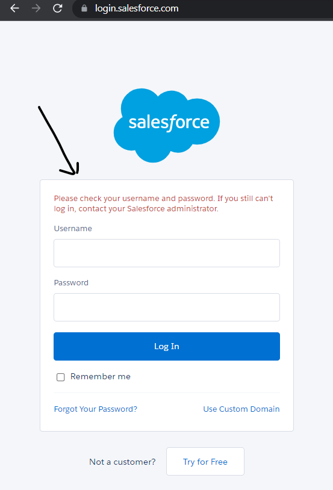
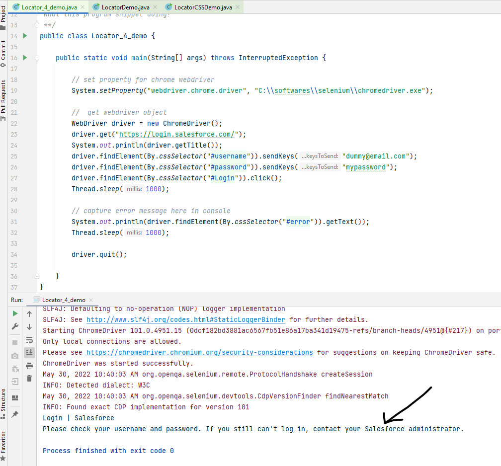

# Locator identifiers in Selenium

## What is locator in selenium
- its one of most important section in Selenium
- Locator is a command that tells Selenium IDE which GUI elements ( say Text Box, Buttons, Check Boxes etc) it needs to operate on. 
- **Identification of correct GUI elements is a prerequisite to creating an automation script**.
- There are commands that do not need a locator (such as the “open” command). However, most of them do need element Locators in Selenium webdriver.
- The choice of locator depends largely on your Application Under Test.

## Different locators

### id

```text
Target Format: id=id of the element
```


**Note**:
- if id is **alphanumeric** then on evey browser refresh,id may vary every time. 
- every object may not have className or name, xpath or css. When inspecting the element we need to identify which element is fixed and can be used to get the handle. 
- Selenium scans element from top left and in case of any conflict it will take the first match 

### name


### linked text


example2 - via partiallinkedtext:
```text
        driver.get("https://www.google.com");
        driver.findElement(By.name("q")).sendKeys("AWS Migration", Keys.ENTER);
        driver.findElement(By.partialLinkText("https://aws.amazon.com/")).click();
        Thread.sleep(4000);
```

Note:
- all links have tag `<a>` so when we see this anchor we can confirm its linked text


- Code added [here](https://github.com/njain51/selenium-maven-demo/blob/1.4.0/src/test/java/com/example/njain51/locators/LocatorDemo.java) for id,name and linkedtext demo 

### classname

Note:
- when we have className with spaces, selenium will not accept it and will throw error "compound classes not accepted"

### xpath

- **xpath and css are most used  and common locators for selenium web testing as above locators may not be available for all elements on web page** 
- Initially we will use browser tools to generate xpath 
  - go to browser field or button, right click and click on inspect 
  - right click on inspect and copy xpath as follows:
  - 
  - when you copy xpath and paste in class, then make sure to change double quotes to single quotes.

- xpath can be written in multiple ways for same object 
- when you see xpath start with `html` then avoid using it as it wont be reliable, switch browser to get another xpath. 
- 
- working example for xpath [here](https://github.com/njain51/selenium-maven-demo/blob/1.6.0/src/test/java/com/example/njain51/locators/LocatorXPathDemo.java)

### css

- can copy css path of element as follows:
- 
- note in actual code css or xpath login code not working as element value is getting changed when inspected in actual browser:
```text
driver.findElement(By.xpath("//*[@id=\'loginbutton\']")).click();
driver.findElement(By.cssSelector("#loginbutton")).click();
```

### Validating xpath

- example, lets say we need to validate "email" element for www.facebook.com in firefox
- generate xpath as above:
```text
//*[@id="u_0_a_hb"]/div[3]/a
```
- next we will write this in following format:
```text
$x("//*[@id='email']")
```
- next we can past it in console ( in developer mode of www.facebook.com) and check output

- so as above we are getting output and on clicking it automatically highlights to email field so it confirms our xpath is correct and we need not wait for test to run to confirm, 
- this way we can save lot of time when writing lenthy tests. 

- this confirms our xpath is validated and we should not get surprise errors when running actual test

- Simialarly css validation can be done but we shouldn't give x instead give extra $
```text
$$("#email")
```

### grabbing error messages

- we can grab error messages we get when we enter wrong username/password
- 
```text
System.out.println(driver.findElement(By.cssSelector("#error")).getText());
```
- 
- working code [here](https://github.com/njain51/selenium-maven-demo/blob/1.8.0/src/test/java/com/example/njain51/locators/Locator_4_demo.java)