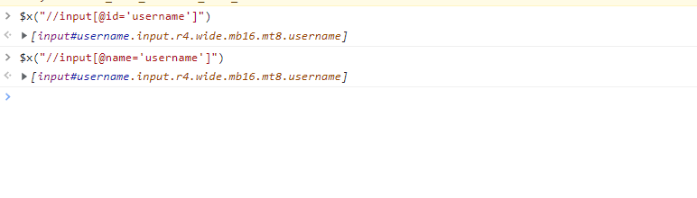
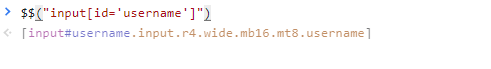
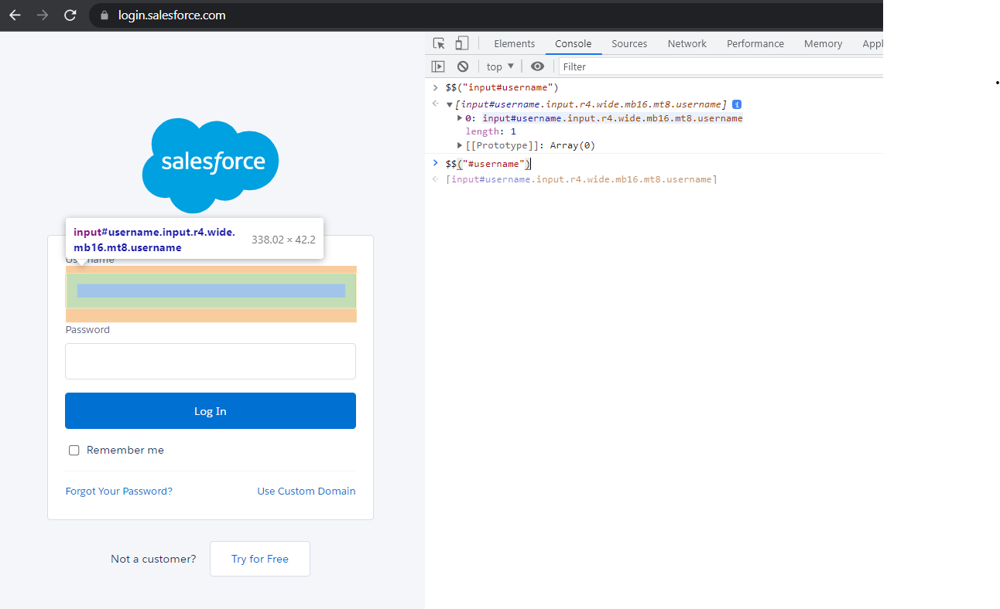

# Getting Custom xpath and css from html element


## xpath
- lets say we have this page: https://login.salesforce.com/
- we will inspect and copy email element:
```text
<input class="input r4 wide mb16 mt8 username" type="email" value="" name="username" id="username" aria-describedby="error" style="display: block;">
```

- here "input" is tagname
- all elements to left of `=` are attributes and all elements to right of `=` are values

```text
input - TagName

class- attribute
input- value

type- attribute
value- email
```

- In order to write xpath for any attribute we use following format:
```text
//tagName[@attribute='value']
```

- example xpath for email will be 
```text
//input[@id='username']
```
- we can verify xpath we created through console as discussed before:


- same result we will get if we directly copy xpath from browser:
```text
//*[@id="username"]
```

## css

- syntax for generating css ( remove // and @)
```text
tagName[attribute='value']
```

- example for username:
```text
input[id='username']
```

- verifying in browser console:



- another syntax for css which is more popular
```text
tagName#attribute
```

- example:
```text
input#username
```

- verification: 
