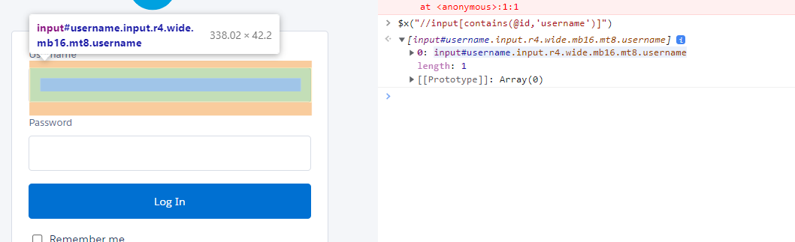
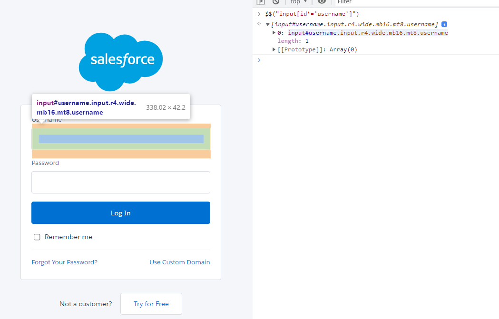

# xpath and css with regular expression

- in case developer have defined only one attribute and that also is alphanumeric( which means it keep on changing) then we can make use of regular expression to locate that element
## Syntax for xpath:
```text
//tagName[contains(@attribute,'value')]
```

- example html:
```text
<input  id="username" >
```
- xpath with regular expression would be:
```text
//input[contains(@id,'username')]
```





## syntax for css

```text
tagName[attribute*='value']
```


- example: 

```text
input[id*='username']
```



- working example [here](https://github.com/njain51/selenium-maven-demo/blob/1.9.0/src/test/java/com/example/njain51/locators/Locator_5_demo.java)
