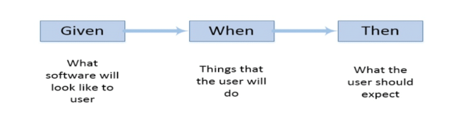

# Gherkin Syntax

- it's language to describe software behavior
- In testing terms it's a language to write test cases
- it's Business Readable, domain specific language
 
## Why Gherkin Syntax Required

- let's take one example: 
```text
popup messge is displayed when buttons are clicked and errors are gone
```
How Developer may  Understand it:
```text
Popup messages are displayed and Errors are gone when button clicked
```

How QA may takes it?
```text
PopUp messages are displayed only when buttons are clicked and errors are gone. 
```

- So in order to maintain same level of understanding when passing the requirement from BA to Developer to QA we use Gherkin Syntax

## Keywords used in Cucumber:

### Scenario
- Cucumber testcase are represented as scenario
- **Scenario** contain **Steps** which are equivalent to **test steps** and use the following Gherkin Syntax:
  - **Given**: PreConditions are mentioned in given keyword
  - **When**: describe user action
  - **Then**: describe expected output/Result
  - **And**: Add more user actions/ Concatenate Actions which are positive
  - **But**: Concatenate Actions which are negative

- So for any requirement that we want to automate with cucumber framework we can write in an above scenario
- In Cucumber whatever requirement we define in above Scenario our development code can be tagged to automate it.




### Feature
- it represents Business requirement 
- to satisfy Business requirement we write multiple test cases or test steps to cover all possible combinations
- Can add optional lines to talk more about features
### Feature File
- Each Feature File must have only one feature
- Feature File acts as Test Suite which consists of all Scenarios
- Scenario which belong to specific area of application can be grouped together to one feature file
- The text that immediately follows the feature keyword and is in the same line is the Title of the feature file
- Feature file contain either scenarios or scenarios outline
- It's written in lowercase with .feature extension
### Scenario Outline 

- it will come into picture when we talk about parameterization or dealing with multiple sets of data

### Step Definition

- Test case written in java for feature implementation 


Note: 
- All Requirements are defined in Feature File which can contain multiple scenarios
- then we code these scenarios or write test cases in Step definition files which are nothing but plain java files
- Feature file scenarios and test definition are tied up.
- Then we have Test Runner class which actually triggers or executes test cases defined in step definitions. it also has info where code is located for feature file. 
- 