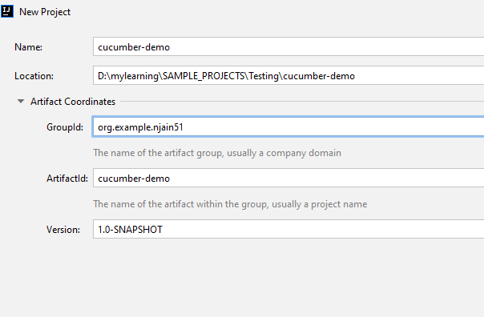
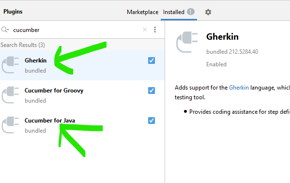
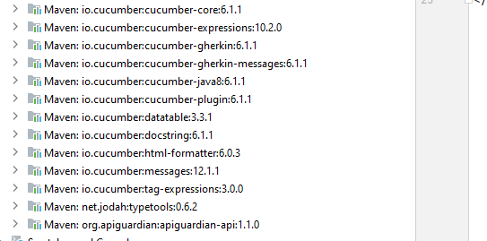

# Cucumber installation #intelliJ

- Cucumber is a testing framework that supports behavior-driven development and allows you to write features and scenarios in a human-readable language.


## Steps
- install java 
- Create new Maven project:
  - 
- install plugins
  - **Gherkin**: Adds support for the Gherkin language, which is used by the Cucumber testing tool. Provides coding assistance for step definitions
  - **Cucumber for java**: Adds support for Cucumber testing tools with step definitions written in Java. Provides coding assistance for step definitions
  - 

- Add Cucumber library:

```text
<dependency>
    <groupId>io.cucumber</groupId>
    <artifactId>cucumber-java</artifactId>
    <version>6.1.1</version>
    <scope>test</scope>
</dependency>
```
Alternatively, if you want to use lambda expressions in step definitions, add:
```text
<dependency>
    <groupId>io.cucumber</groupId>
    <artifactId>cucumber-java8</artifactId>
    <version>6.1.1</version>
    <scope>test</scope>
</dependency>
```

- On maven Reload, Following dependencies are downloaded automatically:
- 

- Make sure that your project has the following folders:
  - **Test Sources Root**: a Test Sources Root icon folder that stores your test code
  - **Test Resources Root**: a Test Resources Root folder that stores files associated with your test sources
