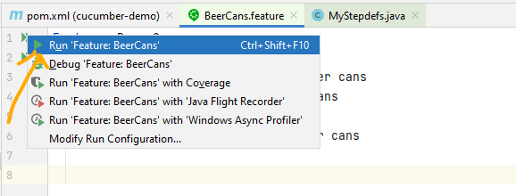
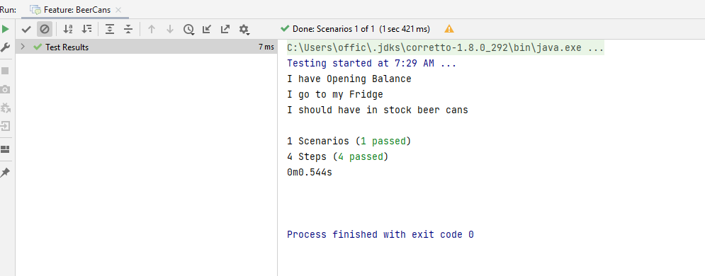

# Create demo project in Cucumber

- we will use [cucumber-demo project](https://github.com/njain51/cucumber-demo) which we configured with cucumber dependencies.
- create features folder: src/test/resources/features 
- add feature file with following sample scenario:

src/test/resources/features/BeerCans.feature
```text
Feature: Beer Cans
  Scenario: Counting Beer Cans
    Given I have <opening balance> beer cans
    And I have drunk processed beer cans
    When I go to my fridge
    Then I should have <in stock> beer cans
```

- create package in src/test/java: org/example/njain51
- stepDefinition file should be matched with TagName and description
- highlight text in feature file and right click to create step Definition class using java(Note java8 will create lambda expressions for step Definition)

```java
/**
 * @author : Nitin Jain
 * @mailto : official.nitinjain@gmail.com
 * @created : 5/22/2022, Sunday
 **/

import io.cucumber.java.en.And;
import io.cucumber.java.en.Given;
import io.cucumber.java.en.Then;
import io.cucumber.java.en.When;

/**
 What this program snippet doing? 
 **/
public class MyStepdefs {
    @Given("I have <opening balance> beer cans")
    public void iHaveOpeningBalanceBeerCans() {
        System.out.println("I have Opening Balance");
    }

    @And("I have drunk processed beer cans")
    public void iHaveDrunkProcessedBeerCans() {
    }

    @When("I go to my fridge")
    public void iGoToMyFridge() {
        System.out.println("I go to my Fridge");

    }

    @Then("I should have <in stock> beer cans")
    public void iShouldHaveInStockBeetCans() {
        System.out.println("I should have in stock beer cans");
    }


}

```
- Run Cucumber tests using this green icon:
  - 
- Check results:
  - 

- Note:
  - we can run all feature by right click on features folder and using `Run All Features Option in IntelliJ`