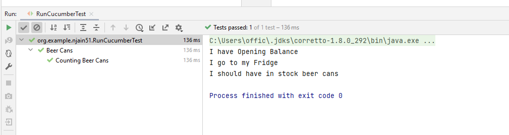

# Run Cucumber Tests with JUnit

- In IntelliJ IDEA, you can use JUnit to run Cucumber tests.
- add JUnit dependency to your project:
```text
        <!-- https://mvnrepository.com/artifact/io.cucumber/cucumber-junit -->
        <dependency>
            <groupId>io.cucumber</groupId>
            <artifactId>cucumber-junit</artifactId>
            <version>6.1.1</version>
            <scope>test</scope>
        </dependency>
```
**Note**: Ensure cucmber-junit dependency is of same version as cucumber-java else we may face issues.

- move the step Definition class to `steps` package
- Create new `RunCucumberTest` class nad modify glue and features path as follows:
```text
package org.example.njain51;/**
 * @author : Nitin Jain
 * @mailto : official.nitinjain@gmail.com
 * @created : 5/22/2022, Sunday
 **/

import io.cucumber.junit.Cucumber;
import io.cucumber.junit.CucumberOptions;
import org.junit.runner.RunWith;

@RunWith(Cucumber.class)
@CucumberOptions(
        features = {"classpath:features/BeerCans.feature"},
        glue = {"org.example.njain51.steps"})
public class RunCucumberTest {
}

```

- Right click on RunCucumberTest class and trigger run


## Troubleshooting

 
- #1
```text
Cucumber: NoSuchMethodError: cucumber.runtime.formatter.Plugins
```
OR 
```text
Cucumber Java error java.lang.AbstractMethodError
```

OR 

```text
InitializationError while running Cucumber JUnit Tests
```

- Resolution:
  - it was all resolved by modifying `cucumber-junit` version to same as `cucumber-java`

