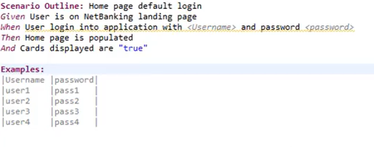
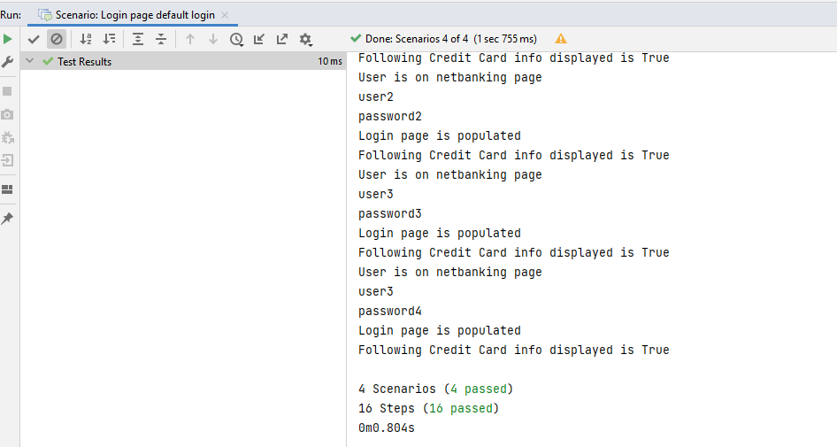
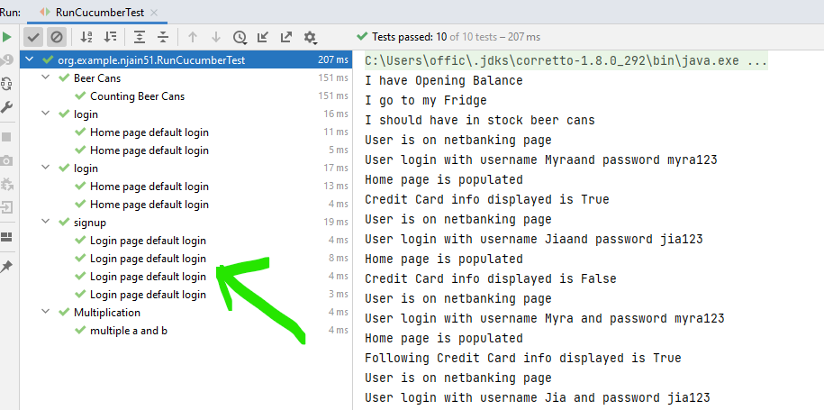

# Parameterizing  test runs with Example keyword

- when we need to run same test multiple times by passing different parameters we can use this practice

- 
  - here `Scenario` is replaced with `Scenario Outline` in .feature file.
  - Instead of double quotes we use `<>`
  - `Examples` keyword is used to pass data to Scenario


- Example code:
```text
Feature: signup
  signup feature implementation for different users
  Scenario Outline: Login page default login
    Given User is on netbanking landing page
    When user login with "<login>" and "<pass>"
    Then Login page is populated
    And Following Credit Card info displayed is "True"
    Examples:
      | login | pass |
      | user1 | password1 |
      | user2 | password2 |
      | user3 | password3 |
      | user3 | password4 |
```

```text
package org.example.njain51.steps; 

import io.cucumber.java.en.Then;
import io.cucumber.java.en.When;

/**
 What this program snippet doing?
 **/
public class Login3StepDef {
    @When("user login with {string} and {string}")
    public void userLoginWithAnd(String arg0, String arg1) {
        System.out.println(arg0);
        System.out.println(arg1);
    }

    @Then("Login page is populated")
    public void loginPageIsPopulated() {
        System.out.println("Login page is populated");
    }
}

```

- When this scenario Login3 is run we will get following output:
- 

- Running all Scenarios with Runner class(note 4 runs for signup):


- Working Code [here](https://github.com/njain51/cucumber-demo/tree/1.0.6)
