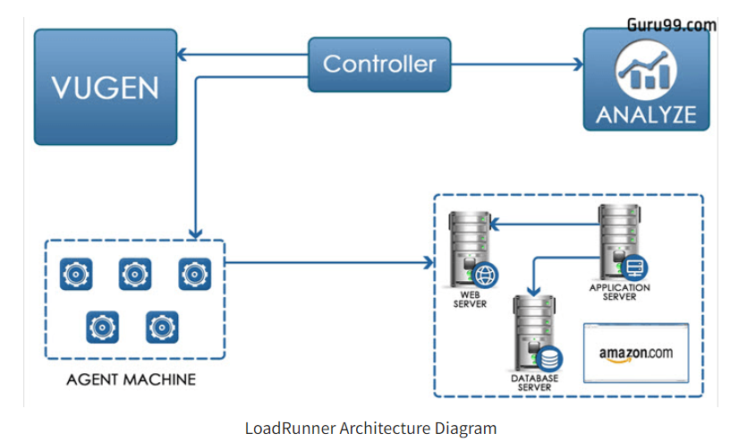

# LoadRunner

- LoadRunner is a **Performance Testing tool** which was pioneered by Mercury in 1999
- LoadRunner was later acquired by HPE in 2006. 
- In 2016, LoadRunner was acquired by MicroFocus.
- LoadRunner supports various development tools, technologies and communication protocols.
- In fact, **this is the only tool in market which supports such a large number of protocols** to conduct Performance Testing. LoadRunner tool supports following: 
  -  RIA (Rich Internet Applications),
  - Web 2.0 (HTTP/HTML, Ajax, Flex and Silverlight etc.), 
  - Mobile, SAP, Oracle, MS SQL Server, Citrix, RTE, Mail and above all, 
  - Windows Socket. 
  - There is no competitor tool in the market which could offer such wide variety of protocols vested in a single tool
- **Performance Test Results produced by LoadRunner software are used as a benchmark against other tools**
- LoadRunner is not only pioneer tool in Performance Testing, but it is still a market leader in the Performance Testing paradigm. In a recent assessment, LoadRunner has about **85% market share in Performance Testing industry**.
- LoadRunner software is tightly integrated with other HP Tools like Unified Functional Test (QTP) & ALM (Application Lifecycle Management) 

## LoadRunner Architecture

- understnading Vugen https://www.guru99.com/understanding-vugen-in-loadrunner.html#5
- 