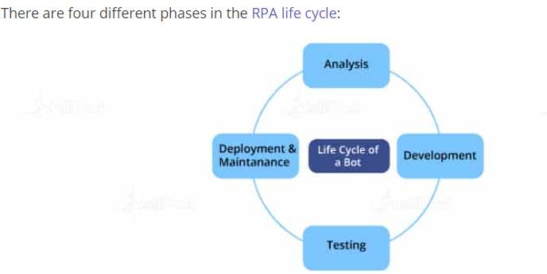

### Compare Robotic Process Automation with traditional automation.

 
 
- integration and customization is excellent and it easily mimic human actions 


### what is RPA?

- Robotic Process Automation (RPA) is a type of software that is used to do automation of the fundamental tasks in software applications like how a human performs them

- The software robot can be trained for a workflow/process with different steps and application. It could be, for example, taking received forms, sending a receipt message, checking the forms for completeness, documenting the form in a folder, and updating a spreadsheet with the form name, the date recorded, etc.


## List the different types of tools in RPA.

- Blue Prism 
- UiPath 
- Automation Anywhere 
- WorkFusion 
- OpenSpan
- Pega

## Describe the life cycle of RPA.



- Analysis: Identifying the business process for which RPA development is needed
- Development of the Bot: Fulfilling the requirements 
- Testing: Performing quality checks 
- Deployment and Maintenance: Deploying and maintaining the bot by the team


## UIPath vs Blue Prism

- Reference:
  - https://www.royalcyber.com/blog/business-operation/comparison-of-top-rpa-players-uipath-vs-blue-prism/

    
- Both tools are reasonably easy to learn, while Blue Prism needs programming skills on the other hand **UiPath provides visual design studi**o along with quick implementation features.
- 

## How would you deploy UiPath?

- install Studio 
- take robot key from orchestrator and enter into UIPath Assistant using orchestrator config url
- publish the procedure - .i.e., package is created
- create environment
- create a release of process
- create a job to run the process
- start job

## How do you invoke a UiPath workflow?
- Workflows are small pieces of common automation that are reusable and applicable in multiple scenarios. They are used to automate similar processes. We can invoke a workflow using the ‘Invoke Workflow’ function in UiPath and save it as a template. We can also combine two workflows to make combined automation.

## What are RPA Bots and how to create them?

- Bot creator tools, such as Automation Anywhere or UiPath, are used to create bots
- The following steps are involved in the creating a bot:
```text
Record a task
Complete the bot implementation
Test the bot
Upload the bot to perform the automation tasks
```


## List the industrial applications of RPA.
- Banking
- Retail
- Telecommunications
- HR


## UseCases for RPA:

- **Beginner**:
  - invoice processing system 
    - successfully develop periodically triggered invoice processing system and extract relevant details from invoices and update in companys database
- Vendor Financial Data Reporting:
  - automated process to generate yearly reports of all finanalcial partners

- deploy multi tier website using amazon ec2
  - enable fast scaling of website 
  - launch ec2 instance to develop and deploy applications

- **Intermediate**:
  - Calculate client security hash
    - ensure security of each client by generating security hash based on their personal info
  - using push notifications
    - send notificaton based on feedback using SNS
  
  - Generating customer data:
    - it involves to empower customer service representative to invoke required billing data of clients with just one click

- **Advance**: 
  - Analyzing the Naming Trends using Python
    - it involves naming trends with python
    - it also involves analyzing data, manipulating data, and data extraction and data visualization 
  - Web scraping:
    - work on various web scraping libraries 
  - data extraction from Resume:
    - scan resumes and extract name,mobile, etc. from each. 