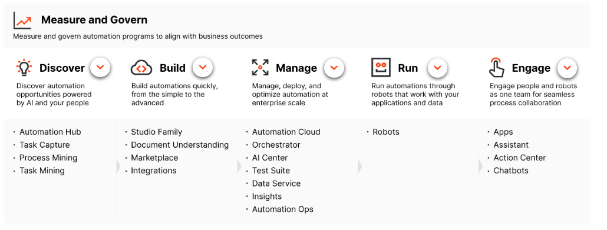
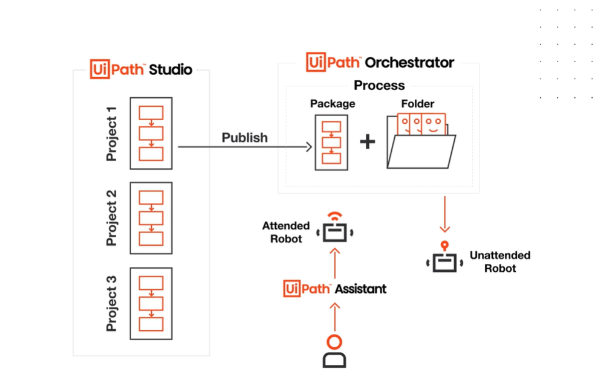
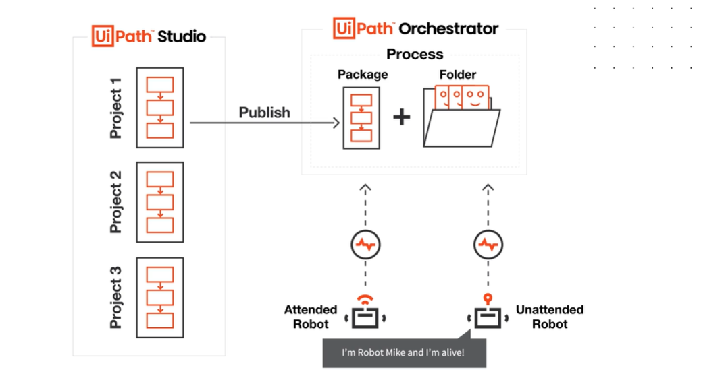
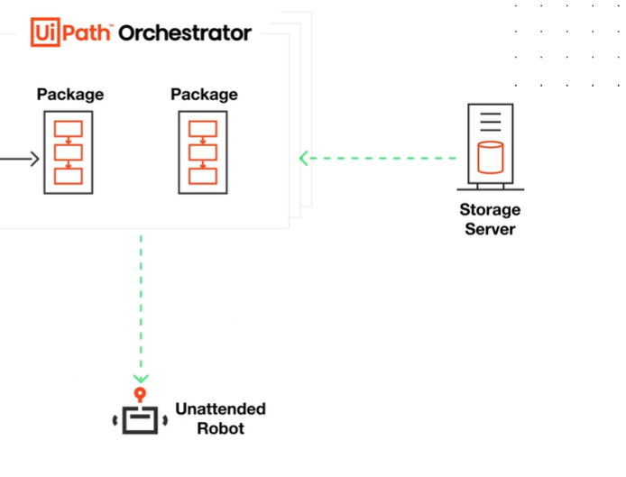

# UIPath Overview:
 

### Prerequisites:

- UiPath Automation Cloud account - https://cloud.uipath.com/credipulrdde/portal_/home
- install Studio, Assistant and Robot.
  - https://download.uipath.com/UiPathStudioCommunity.msi
  - hardware requirements: https://docs.uipath.com/installation-and-upgrade/v2020.10/docs/studio-hardware-and-software-requirements
  - open UIPath Studio from local - community edition

### Explore the UiPath products that empower enterprises for end-to-end automation.

- 2021.10 UiPath product version.
- UiPath starts with RPA and goes for full enterprise automation.
- Enterprise automation combines RPA with other technologies like AI, Process Mining, and advanced analytics to automate more sophisticated work.
- Overview of the UiPath products 

- check [here](The-UiPath-Platform.pdf) for details on each product

### Describe how the UiPath core RPA components (Studio, Orchestrator and Robot with Assistant) work together.

####  1- UiPath Studio 

- its a tool for building automation processes. all coding is done here.

- go to development website of UIPath and download studio from there
  - it's an automation canvas for developers or business users to develop bot.
  - we can also call it as  code editor
- **StudioX** is for Business users
  - let's say for reading emails and download attachment from it.
  - users with low coding experience use it
- Setup is same for all 3, in case we want to switch from studio to studiox then we can just go to settings -> license and profile -> select studio/studioX/studo pro
- it consists of set of activities and packages clubbed together to automate a task.
  - activities appear in studio after importing the correct dependencies
    - like we need to get data from excel , we need to use **excel activity**
    - we will get excel activity from respective dependencies
  - to add new dependencies
    - go to project -> Dependencies -> click on manage -> All pacakges -> search for 'word' since we need to add MS word dependency
    - this way we will get new dependency
    - we can choose which version to download
    - now after dependencies are installed and when we go to activities then we will see all **word** activities

- when we make a new project for example with process template, then by default we get some basic set of packages in UIPath like excel, word etc and for specific ones we can download dependencies
- with studio we can develop, debug and publish your code to orchestrator
- we can develop reusable components
- integration with GIT/SVN/TFS

#### 2- The Robot:
- The Robot executes the processes built in Studio published to Orchestrator or locally.

## UIPath Assistant

- it's an Application which allows you to view, manage, and set reminders for the processes
- it connects to Orchestrator and start Jobs
- it's in Assistant we define Orchestrator path so that whenever we want to publish packages we can publish to given orchestrator
- we can run the jobs triggered from orchestrator
- other task we can do here:
- send to desktop to create shortcut - to directly run the process

- even if we have machine where we don't have UIPath studio but with just assistant we can still run robots
- One assistant can manage one orchestrator at a time.
#### 3- UiPath Orchestrator
- UiPath Orchestrator is a web application that acts as the interface between Studio and Robot and manages, controls, and monitors automation tasks. 

- it also acts as an integration point with third party solutions and applications
  - if we need to add ML/AI then we will need to add in orchestrator only
  - lets say if we want to wook with ML, then ML activities we can get via packages in studio but ML model will be available via orchestrator only.

- its power comes from its capability of managing your entire Robot fleet
- At Orchestrator, we can also check License - Unattended, testing, attended etc.
- Within Orchestrator, we have machines which are basically computers added to it.
### How components work together? 

- RPA Developers build automation projects using the Studio family, to fulfil an automation need.
- These automation projects can then be published as NuGet packages either locally or in Orchestrator. 
- Automation projects published to Orchestrator are stored as packages, along with their versions. If an updated version of a project is available, it is stored as a separate package in Orchestrator.
- now to decide which orchestrator it will go it will be configured in activities preferences.

- To run automation projects, published packages need to be associated with folders. 
- **When a published package is paired with a folder, it becomes a process and can be run by robots with access to the folder**.
- Human users can trigger robots, through the **UiPath Assistant tool** to execute processes on their machines. We call these robots **attended robots**. 
- The robots deployed on separate machines, working without direct human intervention, are called **Unattended Robots**. Process execution for this type of robots is initiated and managed from Orchestrator. 
- In both cases, process execution is done through **jobs**.

- Be it attended or unattended, communication between Robots and the Orchestrator is always triggered by the Robot.
- This is done by the Robot Service component of the Robot through a heartbeat mechanism. Every 30 seconds, the Robot Service sends a heartbeat to the Orchestrator and waits for the Orchestrator to respond. 
- When there is a job to be done, the Orchestrator responds to the heartbeat by passing the job info to the robot. 

- In cases where there are multiple Orchestrators involved in the architecture, the packages that the robots need to execute jobs are kept in an external storage location.
- When a robot runs a job for the first time, it will not have the workflow available locally. 
- The robot then requests the workflow from Orchestrator, which then goes to the storage location, retrieves the correct workflow, and passes it to the robot
-  In such cases, even when a Studio user publishes a package, the Orchestrator moves the package to the storage location, which is retrieved when required. The robot then runs the process. 
