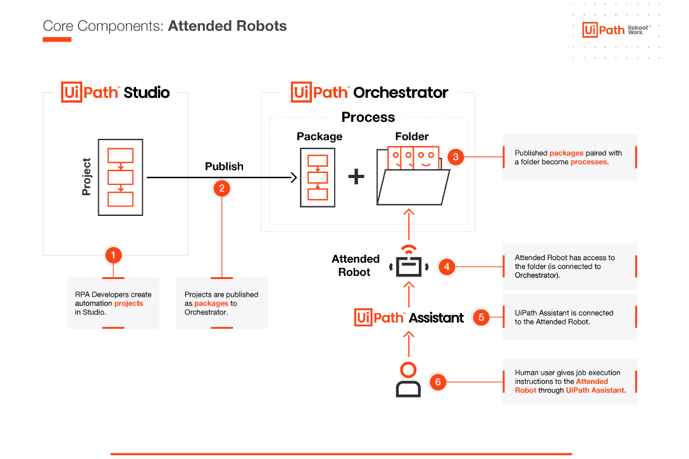
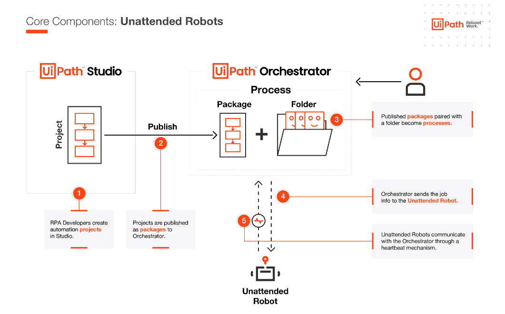

# Attended vs UnAttended Robots Workflow

- Robots:
    - Attended Process
        - machine is open then robot will work, means it requires human intervention

- UnAttended Process
        - even when machine is locked it will work , it can run independently
        - we can only schedule unattended process

