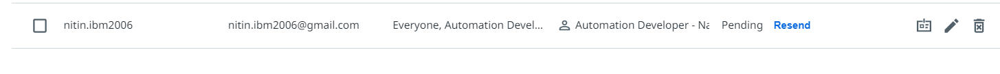
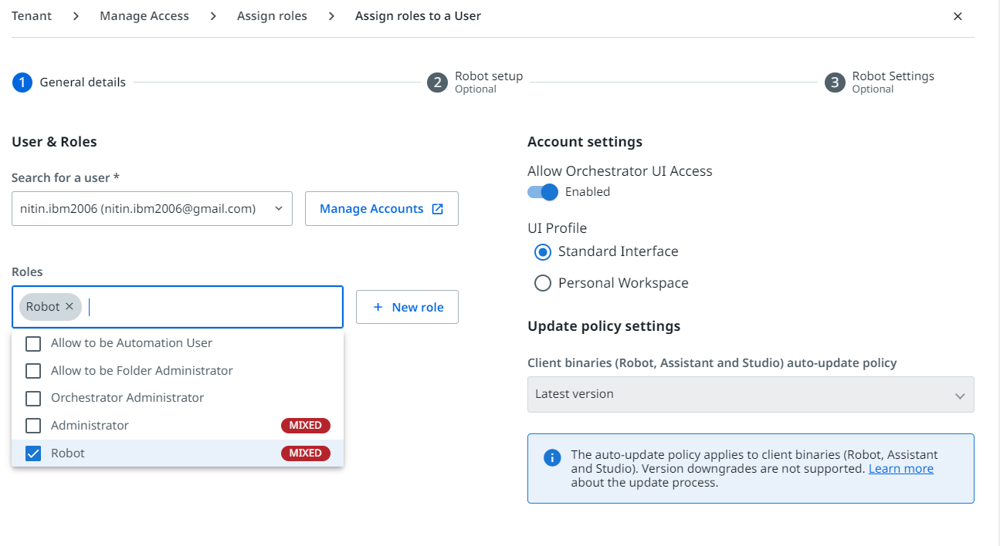
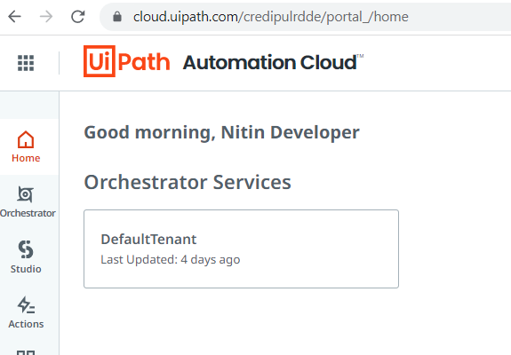
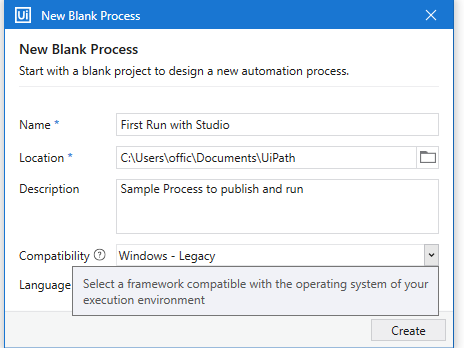
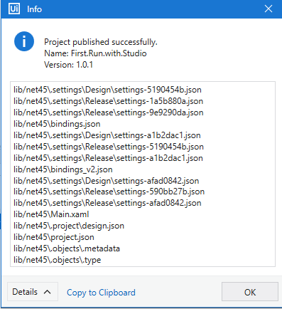
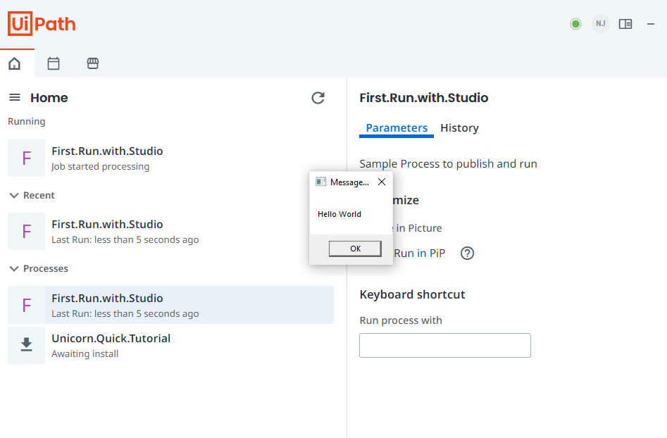

# First Run With UiPath

##  create cloud account and allocate license

- [UIPath Cloud account](https://cloud.uipath.com/credipulrdde/portal_/home)
- setup profile and add organization
- go to admin and add new users as developers and allocate licenses
- 

## use orchestrator to assign role
- Next, go to Orchestrator -> Tenants -> Manage Access -> Assign roles -> skip and assign
- 
- Note: An Automation Developer - Named User license provides a unique user with the right to use Studio, StudioX, attended robot, Data Service, Action Center, and Task Capture.

- go to email and accept role and join organization(don't create new organization)

## download and install studio

- install Studio - > quick installation for community users
-  Assistant and Robot.

## use studio to create project, an activity, and publish to orchestrator

- open studio -> Start -> Process
- 
- click link -> Open Main Workflow -> we will add activities from activity panel
- go to Activities tab from bottom right panel
- modify sequence
- open expression editor by clicking on 3 dots at left panel text
- writing message in quotation mark
- go to design tab and click on publish
- The blue title bar changes based on the type of the project we are publishing. It can be a library, UI library, test cases, templates, or in our case, a process.
- On the ‘Package properties’ tab, we can supply a new package name if needed, a new version, mark the version as alpha, add a package icon, and add the release notes.
- On the ‘Publish options’ tab, we can specify where we want to publish. We’ll be publishing this to our Orchestrator Personal Workspace Feed.
- 
- open UiPath Assistant ( its seperate software installed with sudio)
- go to your newly published process and click on install

- **Note**: demo example is commited here [here](https://github.com/njain51/rpa-demo-examples-uipath)

## Summary: Important

Here are some of the key takeaways:

- An Automation Cloud account allows a user or robot to authenticate on your UiPath platform and to receive authorization to access the resources of your various UiPath products.

- In Orchestrator, on the Manage Access page we can define and assign roles. We use roles to control the level of access an account should have.

- The ‘Robot’ role is a mixed role and includes both tenant and folder permissions.

- In Studio, access the Design tab and click Publish to publish a process to Orchestrator.

- To Run a process published to Orchestrator, we can open UiPath Assistant, select the process from the list, click Install and then Run.

- **When you publish an automation process to the Orchestrator Personal Workspace, a process is created automatically if one doesn't already exist, and existing processes are automatically updated to the latest published version**.
- Larger enterprise customers may choose an on-premises deployment and the integration with Active Directory. In this case, the user groups would be imported in the host tenant, where licenses would also be allocated
- 