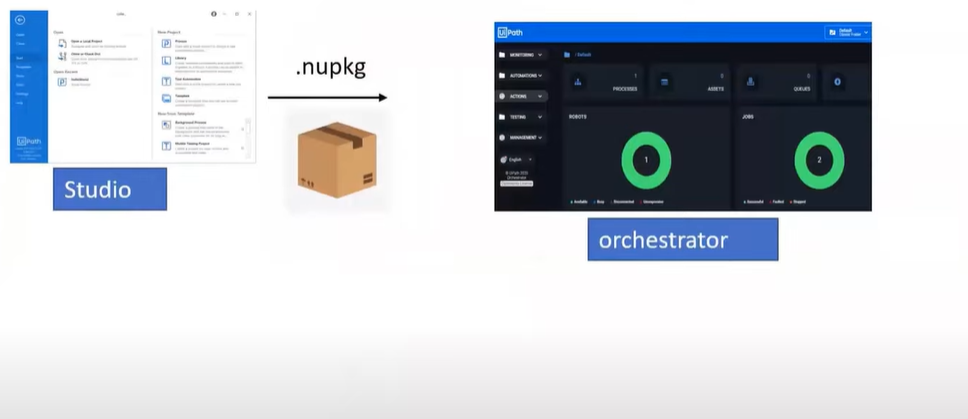

# UIPath intro 

- UIPath Studio 
- UIPath Assistant
- UIPath Orchestrator

## UIPath Studio

- go to development website of UIPath and download studio from there 
  - it's an automation canvas for developers or business users to develop bot. 
  - we can also call it as  code editor
- **StudioX** is for Business users
  - lets say for reading emails and download attachment from it. 
  - users with low coding experience use it 
- UIPath Studio Pro: 
  - for advanced features
    
  
- Setup is same for all 3, in case we want to switch from studio to studiox then we can just go to settings -> license and profile -> select studio/studioX/studo pro

- it consists of set of activities and packages clubbed together to automate a task. 
  - activities come in studio after importing the correct dependencies
    - like we need to get data from excel , we need to use **excel activity**
    - we will get excel activity from respective dependencies
  - to add new dependencies
    - go to project -> Dependencies -> click on manage -> All pacakges -> search for 'word' since we need to add MS word dependency
    - this way we will get new dependency 
    - we can choose which version to download 
    - now after dependencies are installed and when we go to activities then we will see all **word** activities 

- when we make a new project for example with process template, then by default we get some basic set of packages in UIPath like excel, word etc and for specific ones we can download dependencies

- with studio we can develop, debug and publish your code to orchestrator 
- we can develop reusable components
- integration with GIT/SVN/TFS

## UIPath Assistant

- in Studio, we write code, but we use Assistant to run code
- it's an Application which allows you to view, manage, and set reminders for the processes
- it connects to Orchestrator and start Jobs
- it's in Assistant we define Orchestrator path so that whenever we want to publish packages we can publish to given orchestrator
- we can run the jobs triggered from orchestor

- other task we can do here:
  - send to desktop to create shortcut - to directly run the process

- even if we have machine where we don't have UIPath studio but with just assistant we can still run robots
- One assistant can manage one orchestrator at a time.
- 

## UIPath Orchestrator

- Web Application that enables you to orchestrate your UIPath robots in executing repetitive business processes
- it helps manage creation, monitoring and deployment of resources in your environment 
- it also acts as an integration point with third party solutions and applications 
  - if we need to add ML/AI then we will need to add in orchestrator only  
  - lets say if we want to wook with ML, then ML activities we can get via packages in studio but ML model will be available via orchestrator only. 

- its power comes from its capability of managing your entire Robot fleet

- At Orchestrator, we can also check License - Unattended, testing, attended etc. 
- Within Orchestrator, we have machines which are basically computers added to it. 

- we also have roles to define priviledges 

- Robots:
  - Attended Process
    - machine is open then robot will work, means it requires human intervention
  - UnAttended Process
    - even when machine is locked it will work , it can run independently
    - we can only schedule unattended process

## Summary

- Studio, Activities and Orchestrator are 3 independent components
- we are writing code in Studio and when we publish the package ( here .nupkg or nuget package) it will go to orchestrator
- now to decide which orchestrator it will go it will be configured in activities preferences

- In Orchestrator, we create environments to segregate robots
- Orchestrator basically doesn't run every package published, but it only understands **process**
- so it will tell UIPath to create process from given package we have published in studio
- now when converting to process it will ask environment to run
- process doesn't execute on its own
- there is something called **job** which is created from process. we can say its kind of task created
    - either we can schedule this job
    - or I can manually run in realtime mode
- once job is created its executed by Robot
    - this robot is my assistant 

